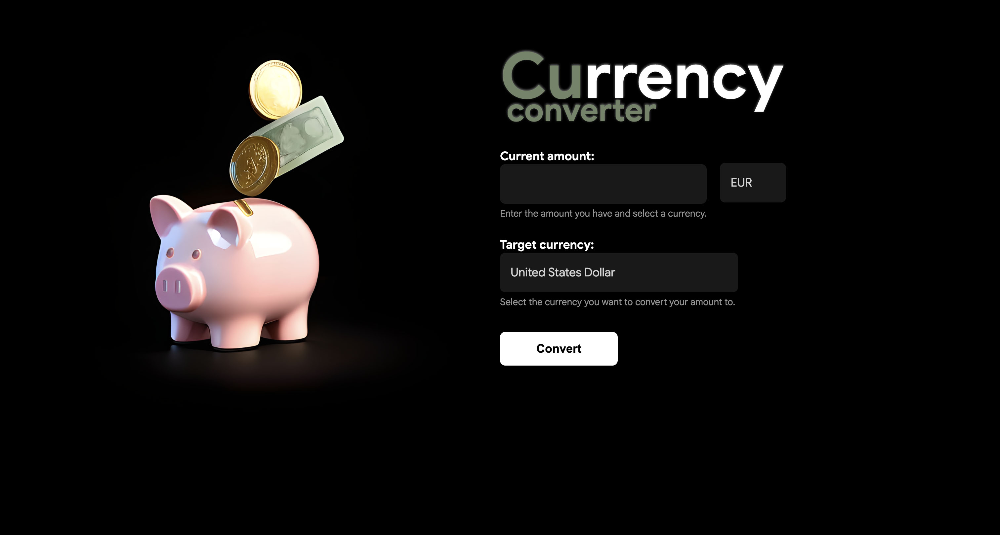
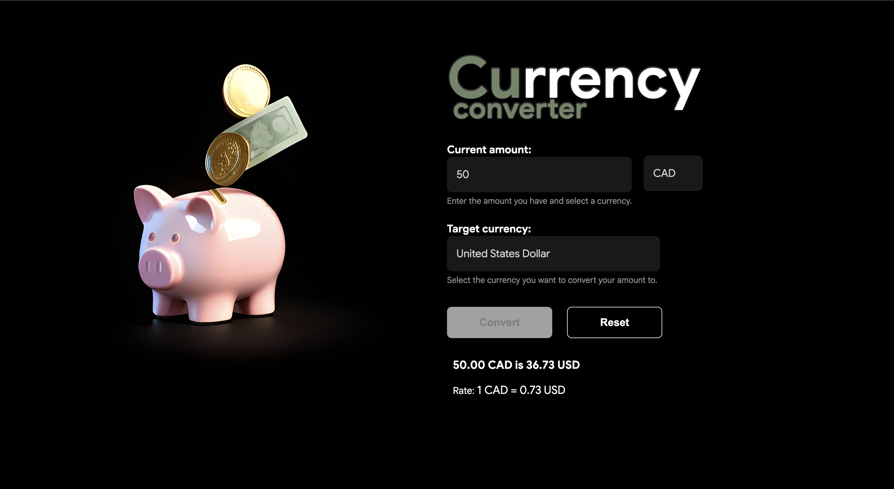

# Currency Converter

A simple currency converter built with **HTML, CSS, and JavaScript**.

---

## Screenshots

---

## Available Currencies

- EUR — Euro
- USD — United States Dollar
- CAD — Canadian Dollar
- AUD — Australian Dollar

---

## Features

- Convert amounts between currencies
- Displays the exchange rate
- Input validation and reset functionality
