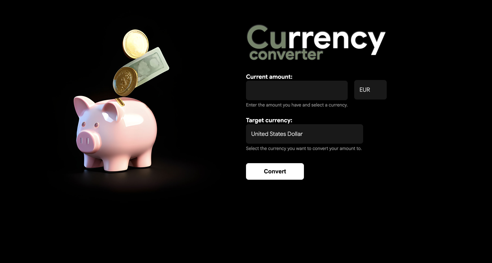
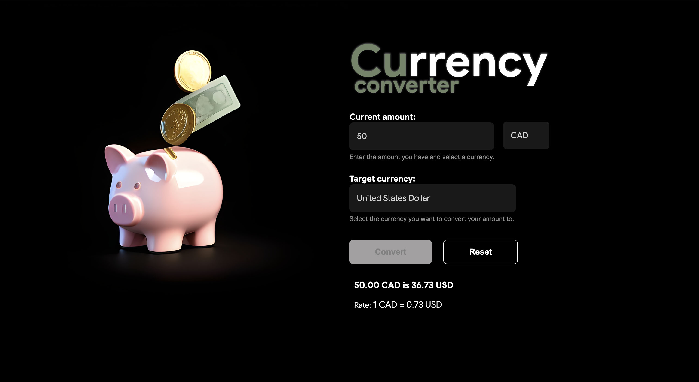

# Currency Converter

Interactive currency converter built with **HTML, CSS, and JavaScript**.

---

## Preview

---

## Features

- Convert amounts between currencies
- Displays the exchange rate
- Input validation
- Reset functionality

---

## Available Currencies

- EUR — Euro
- USD — United States Dollar
- CAD — Canadian Dollar
- AUD — Australian Dollar

---

## Tech

- HTML
- CSS
- JavaScript

---

## What I learned

- Handling user input and validation
- Working with calculations and data
- Updating UI dynamically based on user actions
